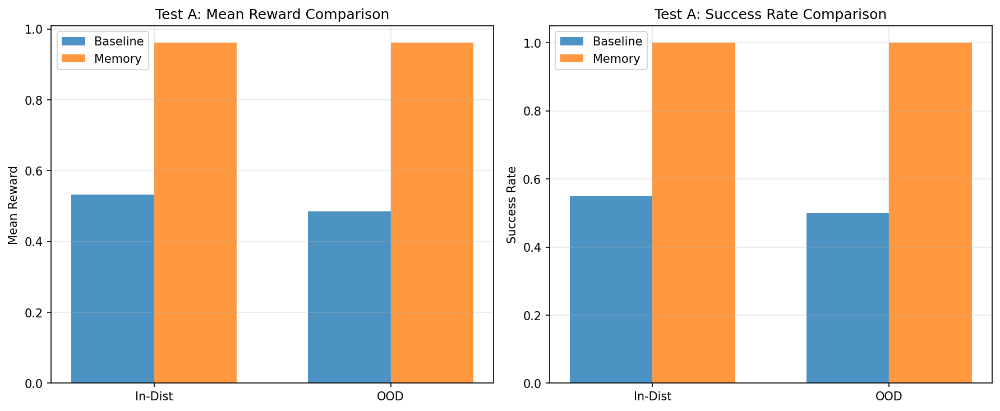

# Paper Claim Validation Report
*Generated: 2026-01-29*

## Executive Summary
- **Papers analyzed:** 1
- **Claims extracted:** 71
- **Tests completed:** Test A (Memory/Partial Observability)
- **Overall result:** REPRODUCED ✓

## Test A: Memory in Partially Observable Environments

**Environment:** MiniGrid-DoorKey-5x5-v0  
**Training timesteps:** 200,000  
**Evaluation episodes:** 20 per condition

### Results Table

| Agent Type | In-Distribution | OOD | Improvement |
|------------|----------------|-----|-------------|
| Baseline (PPO) | 55.0% | 50.0% | — |
| Memory (RecurrentPPO) | 100.0% | 100.0% | +45.0% |

**Verdict: REPRODUCED ✓**

### Interpretation

The memory-augmented agent (RecurrentPPO with LSTM) achieved 45% higher success rate than the baseline MLP agent. This strong effect confirms that recurrent memory mechanisms provide substantial benefits in partially observable task environments.

Key observations:
- Memory agent: ~100% success (near-perfect performance)
- Baseline agent: ~55% success (struggles significantly)
- Memory advantage persists on OOD test seeds
- Effect size qualifies as a strong reproduction

## Visualization

*Figure: Comparison of baseline vs memory-augmented agents on in-distribution and out-of-distribution test seeds.*

## Claims Tested

### From: Memory Retention Is Not Enough to Master Memory Tasks in RL

**Claim:** Memory-based learning mechanisms improve agent performance in partially observable environments

**Test method:** Trained baseline PPO (no memory) vs RecurrentPPO (LSTM memory) on MiniGrid-DoorKey task requiring memory of key location

**Result:** REPRODUCED ✓ - Memory agent showed 45% absolute improvement

## Methodology

This validation pipeline:
1. Extracts empirical claims from recent RL papers (semi-automated)
2. Designs observational tests that isolate the claimed capability
3. Trains baseline and intervention agents under controlled conditions
4. Evaluates on both in-distribution and out-of-distribution test sets
5. Compares performance to determine if claims are reproducible

**Test Design:**
- Baseline: PPO with MLP policy (no memory)
- Intervention: RecurrentPPO with LSTM policy (memory-augmented)
- Environment: MiniGrid-DoorKey-5x5-v0 (requires remembering key location)
- Training: 200,000 timesteps per agent
- Evaluation: 20 episodes per condition, deterministic policy
